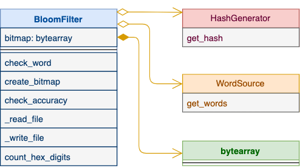
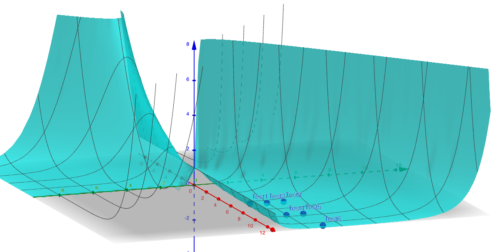
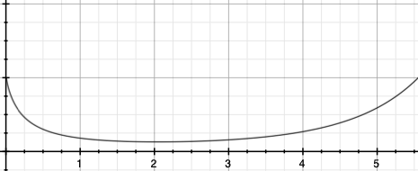

# Bloom Filter

This folder contains python [code](bloom_filter.py) implementing a [bloom filter](http://codekata.com/kata/kata05-bloom-filters/) for spell check.

## Dev Environment and Language
A small [program](bloom_filter.py) has been implemented in python 3. It is developed on 
Debian 9. Two dictionaries have been used for testing:
* /usr/share/dict/words on Debian 9. This dictionary contains 99171 words. It
was used to do most of the tests below.
* nltk.corpus.words. This one contains 235892 words. Need to install nltk to use this dict.

## Design
Even though this is just a very small program, it is designed by using Design Patterns
following OOD principles. Even though this may be overkill here, but
it nevertheless provides flexibility for further extension.

### UML class diagram


There three major components of the program.
* A class called BloomFilter encapsulates the python3 bytearray using for 
storing the bitmap.
* A facade class called HashGenerator. It unifies the interface to get different types of hashes. Also it _decouples_ BloomFilter
from what hash to use and how it is generated. In the future, if we need to support
more hash type, only this class needs to be modified, and BloomFilter can remind the same.
* A facade class called WordSource, using Facade design pattern. This class encapsulates
how to get words from different sources.

## Features
This program is a command line tool that supports 3 subcommands.

### 1. Build
This subccommand builds the bitmap for a given dictionary, and save it to a file.

Usage:
``` 
python3 bloom_filter.py build
```
Optional parameters:
* -i: input dictionary. Default to /usr/share/dict/words on Debian. Use "-i nltk" to download nltk words.
* -o: output bitmap file. Default to ./bitmap.bin
* -n: number of checksums to use. Default to 1:
    * 1: only md5 is used
    * 2: use md5 and sha256
    * 3: use md5, sha256, and crc32
* -s: size in KB. Default to 64.

### 2. Check
This subcommand makes use of the bitmap built above to do spell check of a given word.

Usage:
``` 
python3 bloom_filter.py check _word_
```
Optional parameters:
* -i: input bitmap. Default to ./bitmap.bin
* -n: number of checksums to use. Default to 1. Must match the bitmap


### 3. Accuracy
This subcommand computes the false-positive rate by generating 1000 random "word"s and test the bloom filter.

Usage:
```
python3 bloom_filter.py accuracy
```

Optional paramters:
* -n: number of randomly generated words to use. Default to 1000
* -w: word dictionary. Default to /usr/share/dict/words
* -i: input bitmap. Default to ./bitmap.bin
* -c: number of checksums to use. MUST match the one used to build the bitmap. 
Default to 1

## Tests
As recommended by the author of the [webpage](http://codekata.com/kata/kata05-bloom-filters/), tests were performed using
different numbers of hashes, and with different bitmap sizes. The "accuracy" subcommand
mentioned above is used to do these tests. The results
are presented in the following table. Please refer to the following
subsections for details of each test.

| Test | Bitmap Size (in KB) | Number of Checksums | False-positive Rate |
|---|---|---|---|
| Test 1| 64 | 1|~15.7% |
| Test 2| 64 | 2|7.7% ~ 10.2%|
| Test 3| 64 | 3|7.8% ~ 10%|
| Test 4| 96 | 2|~5.1% |
| Test 5| 96 | 3|~5% |
| Test 6| 128| 3|~1.6%| 


### Test 1: 1 checksum, 64KB
Following the suggestion for optional exercise, 1000 random 5-char words were 
generated. 157 words pass the spell check. None of them can be found in the 
dict. 

Note that when bitmap size is 64KB, the filled-rate is around ``99171/64*1028*8 = 18%``. Or say 18% of
 the bits are set to 1's. This is close to ``157/1000=15.7%``, the test result above. This makes sense 
because a random word corresponds to a random bit in that bitmap. So it has a chance of 18% to clash
with a bit already set. 

### Test 2: 2 checksums, 64KB
The error rate drops down to 7.7% ~ 10.2%.

When two checksums are used, the filled-rate is doubled to be around 37%. Since two _independent_ checksums
are computed (md5 and sha256), this can be thought as two _independent_ events of randomly
picking a bit from the bitmap. To get _both_ clashes, the chance is roughly 
```37%*37% = 13%```. This is close to the test 
result obtained here.

### Test 3: 3 checksums, 64KB
For this test, the false positive rate increases slightly to ~10%.

The filled-rate is now ~54%. Three _independent_ events give ```54%**3=15%```.
Close to the test result obtained.

This is an example that shows more checksums do not _necessarily_ help too much to lower down
the false positive rate. Refer to the discussion section below.

### Test 4: 2 checksums, 96KB
The error rate drops to 5.1%.

Compared to test 2 above, the filled-rate drops to ```37%/1.5=24%```. So for two
_independent_ events, statistically it shall be ```24%*24%=6.05%```. This is close 
to what we got.

With the same number of checksums as Test 2, bigger bitmap helps to lower down
false positive rate.

### Test 5: 3 checksums, 96KB
The false positive remains the same around 5%.

Here the filled-rate is 37%, so three _independent_ events gives ```0.37**3=0.054```.
Thus, even for bitmap size of 96KB, 2 checksums are good enough. 3 checksums give almost
the same result.

### Test 6: 3 checksums, 128KB
The false positive rate drops to 1.6%.

The filled-rate is 28%. Three _independent_ events give 2.1%. Again close to what we get. 

Therefore, the bitmap size needs to be at least 128KB for 99171 words if we want to use
3 checksums.

## Discussion
### Choose size of bitmap
Of course the bigger the better. As pointed out above, one can _roughly_ estimate the
false-positive rate as (num_words*num_checksums/size_in_KB/1024/8)<sup>num_checksums</sup>. No
matter how many words or how many checkums to use, it is always better to increase size_in_KB in 
the above expression. Note in this _rough_ estimate, we did not take into account clashes when
the bitmap is generated. According to our test, roughly 10% clashes. Thus this _estimate_ tends to be higher than the real one.

For num_words = 99171, we can plot the above equation in 3D space.


In the above plot, the blue axis is for false positive rate, the green axis is 
for number of checksums, and the red axis is for bitmap size in 10KB. Those six test results
above are also plotted. They are indeed lower than the estimate, but still close.

In practice, this means we shall always choose the max size allowed for the bitmap first.

### Choose number of checksums to use
Unlike the size of the bitmap, as for number of checksums, it is not always 
the more the better. When there are too many chekcums, the whole bitmap could be filled 
with 1's, and the false positive rate is 1 then. 

Therefore, there is an optimized value for number of checksums. 
For a 64KB bitmap to cover 99171 words, we can 
plot this, with n being the number of checksums to use:
```
(0.18*n)**n
```


As shown in the above graph, 2 is the _estimated_ optimized value. 

In practice, once we choose the size of the bitmap, we need to figure out the number of words we want
to support. Then we can plot the above equation to find the _estimated_ optimized number of checksums to use. 
Try several choices around the estimated value to pick the best.

### Is the author correct?
The author of the [webpage](http://codekata.com/kata/kata05-bloom-filters/) first claimed that 16kb for 80,000 words.
This can't be right. Assume that he is talking about ```16kbytes = 16,000bytes = 128,000 bits```. Roughly 62% of the bitmap 
are filled with 1's. Most likely 1 or 2 checksums to use, and the false-positive rate will be still around 50%.

He made an update later and changed the bitmap size to 64kb. According to our tests, the best false-positive
rate is still around ~6%-7%. The dictionary here is of size of 99,171, the author used 80,000, the false-positive
rate for him could be lower. However it shall most likely be around ~3%-5%. But he claimed
> I very rarely saw it let though an incorrect word

This makes us wonder his definition of _rarely_.

### What does Bloom Filter get for us?
The dictionary on Debian with 99171 words is of size of 938,848 bytes (10 chars/word averagely). 
Using a 64KB (7% of the dictionary size) with 3 to 4 checksums, we can get ~8% false-positive rate. 
Or a 128KB (14% of size) bitmap to get false-positive rate around 1%.

## Future Improvement
If this small program is a product, there are some missing requirements. 

### Case-sensitive or not
The dictionary on Debian contains two kinds of words:
* All lower cases
* Only the first char is upper case, the rest are lower case

So this spell check program was built to be case sensitive. Not sure this is a correct decision though.

Currently it is the responsibility of the caller to convert to proper case before
calling this program (think about the first word of a sentence for example).

### Support for more checksums
Right now it only supports md5, sha256, and crc32. With the Facade design pattern used here, it is easy to extend to cover more kinds of checksums.

### Support for more word sources
Currently this program supports reading words from a file, or download words
from nltk. More word source can be easily added.

### More features
Potential new features include spell check for a given sentence or an input file. These two can be 
easily done if they are required.

With python Flask, we can even provide this as a micro service, or build 
RESTful API for it easily. 
