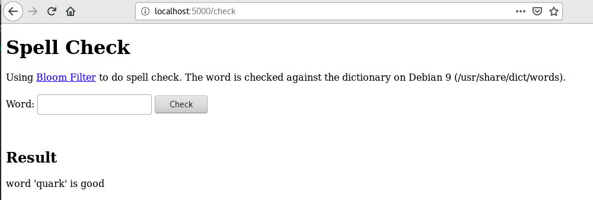

# Online Spell Check
This is a POC to create an online spell checker using Bloom Filter. 

The [Bloom Filter](http://codekata.com/kata/kata05-bloom-filters/) for spell check.
The python code is in this [folder](BloomFilter). 

Python Flask is used to provide web service and REST API for online spell check.
## Design
Use [flask web form](https://pythonspot.com/flask-web-forms/) to generate a html page. 
The [template](templates/spell-check.html) is straightforward.

## RESTful API
In addition, we follow this [post](https://blog.miguelgrinberg.com/post/designing-a-restful-api-with-python-and-flask) to 
add RESTful API to the flask server.

python [code](app.py).

## Test
Use this to start the Flask server in standalone mode
```python3 app.py```

### web service
Use a browser to visit http://localhost:5000/check


### RESTful API
Use this curl command to get spell check of a given word
```curl -i http://localhost:5000/api/v1.0/check?word=Good```


Now ready to go up to Docker folder to build a docker image for this python app.