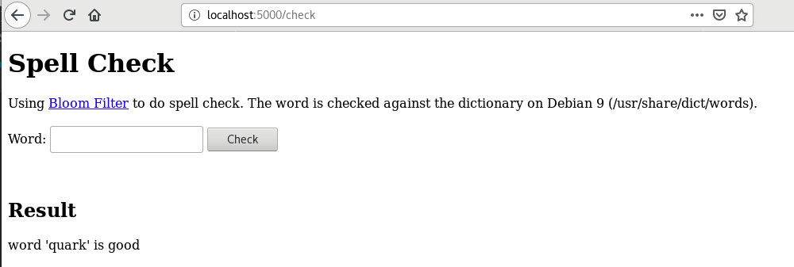

# Kubernetes

This is a POC project for using Kubernetes/Docker/Flask API. Dependencies
* Minikube
* Docker
* python Flask, for web service and RESTful API service

The above techniques are used to demo an online spell checker 
implemented using [bloom filter](Minikube/Docker/Flask/BloomFilter/README.md) in python.

## Final output
The output of this POC is a python Flask server running in a docker container hosted in a local
Kubernetes cluster managed by minikube.

User can use the online spell checker via a browser or through the RESTful API.

### Web service 

### RESTful API
Use 

```curl http://localhost:_port_/api/v1.0/check?word=quark```


## Project structure 
The structure of this repo
* Minikube
    * Docker
        * Flask
            * BloomFilter
            
## Approach
To use this POC, do it from inside out. 
1. First go to the [BloomFilter](Minikube/Docker/Flask/BloomFilter) folder to test the bloom filter as a standalone python program. 
Make sure you can generate a bitmap.bin file. This file will be used by the final program.
2. Go to the [Flask](Minikube/Docker/Flask) folder, make sure you can use the bloomfilter from a flask server, serving both
web and RESTful API.
3. Go to the [Docker](Minikube/Docker) folder, make sure you can make a docker image and use the flask server in a docker container.
4. Finally back to this folder, and try Kubernetes.

## Minikube
Here we follow this [post](https://linuxhint.com/kubernetes-getting-started/) and use Minikube on Linux to create
local Kubernetes cluster.

### Environment
This is running on virtual machine of Debian 9 using virtualbox. To setup minikube of virtual machine, follow this
[post](https://medium.com/@vovaprivalov/setup-minikube-on-virtualbox-7cba363ca3bc). The above post has instruction about
installing kubectl as well. 

### Steps
1. Make sure you follow the steps in the Approach section above to build and test the docker image. 
Run 

    ```docker image ls```

    and you shall see scweb is listed there.
2. Start minikube. Since we are using virtual machine, need to start it with vm_driver=none as suggested by 
this [post](https://medium.com/@vovaprivalov/setup-minikube-on-virtualbox-7cba363ca3bc).

    ```sudo -E minikube start --vm-driver=none```

    Use 
    
    ```kubectl cluster-info``` 
    
    to make sure minikube is running.
3. Run a node 
    
    ```kubectl run my-node --image=scweb --port=5000 --image-pull-policy=Never```
4. Check deployment 

    ```kubectl get deployments```
5. Check pods 

    ```kubectl get pods```
6. Create a servide 

    ```kubectl expose deployment my-node --type=LoadBalancer```
7. Check service 
    
    ```kubectl get services``` 
    
    Take note of the PORT(S) of my-node. 

    In this example, port 30471 is mapped to the port 5000 of the docker container. 
8. Use the port information above to test the deployment/service. 
For our example here, open a browser and visit http://localhost:30471/check
    
9. To test the RESTful API, use this curl command

    ```curl http://127.0.0.1:30471/api/v1.0/check?word=quark```
    
    

    _NOTE_: minicube is not very stable in supporting curl. At the beginning, we
were able to test the RESTful endpoint using a browser, but curl hung all the time.
Then we just run 

    ```minikube service my-node --url``` 

    This command shows correctly the url for the service. From then on, the curl command works.
This could be related to this [bug](https://github.com/kubernetes/minikube/issues/1419).

### Stop and clean up
```kubectl delete service my-node```

```kubectl delete deployment my-node```

```minikube stop```
            
 